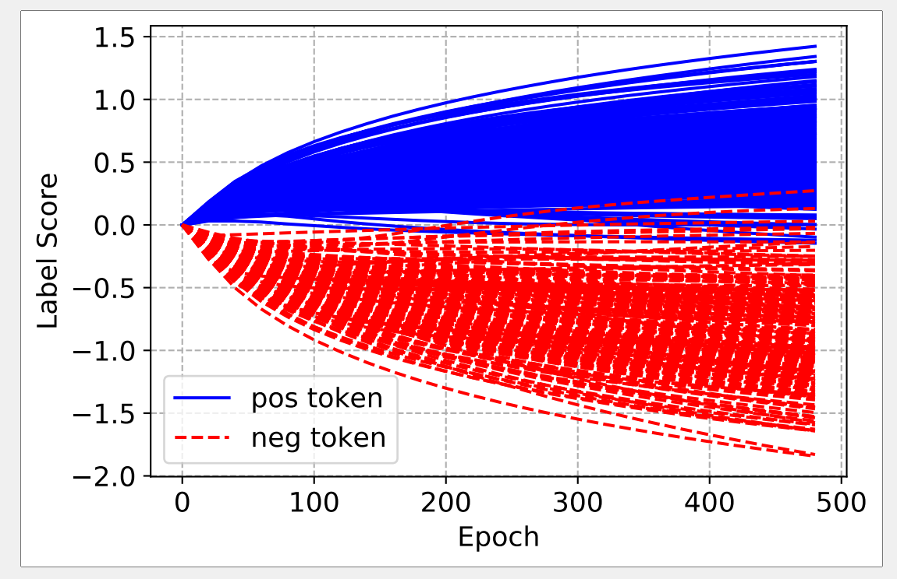

This project aims to interpret the feature extraction mechanisms of neural networks from a theoretical perspective.

# Unraveling Feature Extraction Mechanisms in Neural Networks
This is the Pytorch code for the paper [Unraveling Feature Extraction Mechanisms in Neural Networks](https://arxiv.org/pdf/2310.16350v2.pdf), which has been accepted by the main conference of EMNLP 2023.
<p align="center">
 
</p>
The underlying mechanism of neural networks in capturing precise knowledge has been the subject of consistent research efforts. In this work, we propose a theoretical approach based
on Neural Tangent Kernels (NTKs) to investigate such mechanisms. Specifically, considering the infinite network width, we hypothesize the learning dynamics of target models may intuitively unravel the features they acquire from
training data, deepening our insights into their internal mechanisms. We apply our approach to several fundamental models and reveal how these models leverage statistical features during gradient descent and how they are integrated
into final decisions. We also discovered that the choice of activation function can affect feature extraction. For instance, the use of the ReLU activation function could potentially introduce a bias in features, providing a plausible
explanation for its replacement with alternative functions in recent pre-trained language models. Additionally, we find that while self-attention and CNN models may exhibit limitations in learning n-grams, multiplication-based models
seem to excel in this area. We verify these theoretical findings through experiments and find that they can be applied to analyze language modeling tasks, which can be regarded as a special variant of classification. Our contributions
offer insights into the roles and capacities of fundamental components within large language models, thereby aiding the broader understanding of these complex systems

## Requirements
* Python version >= 3.9
* Pytorch version >= 1.1

## Data
* SST
* IMDB
* Agnews
* PTB
* Wikitext2

## Citation
```
@misc{sun2023unraveling,
      title={Unraveling Feature Extraction Mechanisms in Neural Networks}, 
      author={Xiaobing Sun and Jiaxi Li and Wei Lu},
      year={2023},
      eprint={2310.16350},
      archivePrefix={arXiv},
      primaryClass={cs.CL}
}
```


